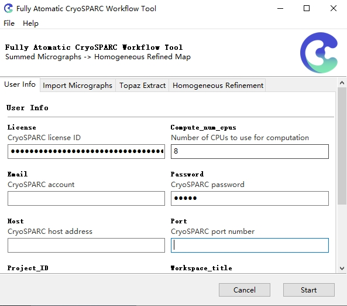

<!--
 * @Author: Dylan8527 vvm8933@gmail.com
 * @Date: 2023-09-17 14:55:31
 * @LastEditors: Dylan8527 vvm8933@gmail.com
 * @LastEditTime: 2023-09-17 16:12:50
 * @FilePath: \Make-Scripts-Great-Again\README.md
 * @Description: 
 * 
 * Copyright (c) 2023 by ${git_name_email}, All Rights Reserved. 
-->
# AutoCryoSPARC

This tool is designed to automate the process of importing summed micrographs into CryoSPARC, and then running towards a homogeneous refinement job. The whole workflow is based on the [CryoSPARC API](https://tools.cryosparc.com/examples/custom-workflow.html).
- Import Micrographs
- CTF Estimation (CTFFIND4)
- Topaz Extract
- Extract Particles
- 2D Classification
- Select 2D 
- Ab-Initio Reconstruction
- Homogeneous Refinement

<p align="center">
  
</p>

<!---------------------------------- Updates --------------------------->
## 🚩 Updates
- ✅ Portable [Windows](https://github.com/Cellverse/Make-Scripts-Great-Again/releases/download/v0.1.0/autocryosparc-20230917-windows.zip) **executable files**

## 🔧 Develop Installation & Package
- Python >= 3.7 (Recommend to use [Anaconda](https://www.anaconda.com/download/#linux) or [Miniconda](https://docs.conda.io/en/latest/miniconda.html))
- Download & Manage Tools: [Git](https://git-scm.com/download) and [Git LFS](https://github.com/git-lfs/git-lfs)

### Installation

1. Clone repo

    ```bash
    git clone https://github.com/Cellverse/Make-Scripts-Great-Again.git
    cd Make-Scripts-Great-Again
    ```
    
2. Create and activate a conda environment named "tools" with the desired python version. 
   ```sh
   conda create -n tools python=3.7 -c conda-forge
   conda activate tools
   ```

3. Install dependencies
   ```sh
   # gooey GUI
   conda install -c conda-forge gooey
   # cryosparc-tools for connection
   pip install cryosparc-tools & pip install -U cryosparc-tools
   # Pyinstaller for packaging
   pip install pyinstaller
   ```

### Packaging

1. Package under Windows 
    ```sh
    cd packaging/win
    cp -r ../../images images
    cp ../../src/main.py main.py
    pyinstaller build.spec
    $currentDate = Get-Date -Format "yyyyMMdd"
    $folderName = "autocryosparc-$currentDate-windows"
    Move-Item -Path "dist/", "images/" -Destination $folderName
    Compress-Archive -Path $folderName -DestinationPath "$folderName.zip"
    ```
    Inside of the packaging/win/dist/ directory, you'll find a beautiful stand-alone executable that you can distribute to your users.
    